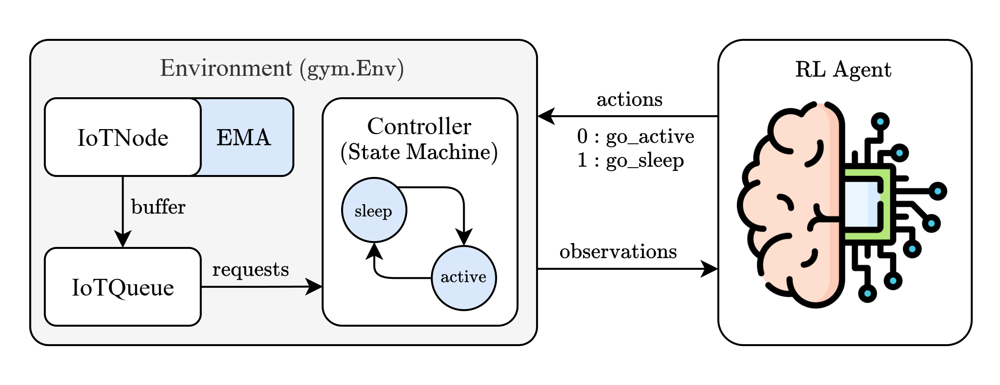
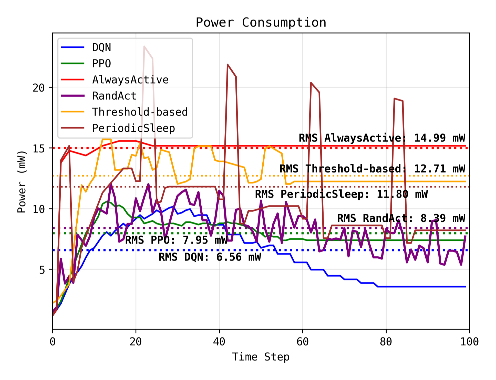

# Intelligent Power Optimization for IoT Devices

This project explores the use of Reinforcement Learning (RL) to optimize power consumption in an IoT system. The system consists of:

* **IoT Node:** Device that generates requests for service
* **Controller:** Device that manages the power state (active or sleep) of the IoTNode
* **IoT Queue:** Queue that buffers requests from the IoTNode

The goal is to train an RL agent (acting as the brains of Controller) to minimize the total power consumption of the IoTNode, while still efficiently handling incoming requests.

<!-- block diagram centered : resources/block.png -->
<p align="center">
  
</p>

## Repository Structure

The repository is organized as follows:

```powershell
iot-power-optim/
├── config
│   ├── __init__.py
│   └── default.py    # Default configuration settings
├── structs
│   ├── __init__.py
│   └── queue.py    # Queue data structure
├── system
│   ├── __init__.py
│   ├── controller.py   # Controller class
│   ├── environment.py    # Environment class
│   └── node.py   # IoTNode class
├── figs/
├── logs/   # Training logs and model checkpoints
├── resources/
├── README.md
├── LICENSE
├── .gitignore
├── pyclean.sh
├── requirements.txt
└── train.py
```

## Environment

The environment is implemented using the [Gymnasium (Gym)](https://gymnasium.farama.org/) framework.
It simulates the dynamics of the IoT system, including:

* **Request arrivals:** Requests arrive at the IoTNode according to a predefined pattern (e.g., inter-arrival times).
* **Controller actions:** The Controller can choose to put the IoTNode in either "active" or "sleep" mode.
* **Power consumption:** The IoTNode consumes different amounts of power depending on its state (active or sleep) and the time spent transitioning between states.
* **Queue management:** The IoTQueue buffers requests, and the Controller must decide when to process them based on the queue length.
* **Rewards:** The agent receives rewards based on the power consumption and potentially other factors, such as queue length.

## Agents

The project implements two types of RL agents:

* `DQN (Deep Q-Network)` – A value-based agent that learns a Q-function to estimate the expected future rewards for each action in a given state.
* `PPO (Proximal Policy Optimization)` – A policy-based agent that directly learns the policy (mapping from states to actions) that maximizes rewards.

## Baselines

To assess the performance of the RL agents, several baselines are implemented:

* `AlwaysActive` – The controller is always in the active state.
* `RandomAct` – The controller randomly chooses between active and sleep modes.
* `Threshold-based` – The controller sleeps when the queue length drops below a threshold and wakes up when it exceeds another threshold.
* `PeriodicSleep` – The controller alternates between active and sleep modes with fixed durations.

## Training and Evaluation

To train and evaluate the RL agents, use the `train.py` script. Usage:

```bash
python train.py [-h]
                [--eval-only]
                [--agent {DQN, PPO, both}]
```

## Power Consumption _(Analysis)_

The following figure shows the power consumption of the IoTNode for different agents and baselines:

<!-- block diagram centered : resources/power_consumption.png -->
<p align="center">
  
</p>

As shown, the RL agents (`DQN` and `PPO`) achieve lower RMS power values compared to the baselines, indicating better power optimization. The `AlwaysActive` baseline consumes the most power, as the IoTNode is always active, while the `Threshold-based` and `PeriodicSleep` baselines show intermediate power consumption. The `RandomAct` baseline exhibits high variance in power consumption due to its random nature.


## Future Work

Possible extensions of this project include:

* **More complex environments:**  Incorporate more realistic IoT system dynamics, such as varying request sizes, multiple nodes, and different power consumption models.
* **Advanced RL algorithms:** Explore more sophisticated RL algorithms, such as A3C, SAC, or TD3, to potentially achieve better performance.
* **Real-world implementation:** Deploy the trained RL agents on real IoT devices to validate their effectiveness in a practical setting.
